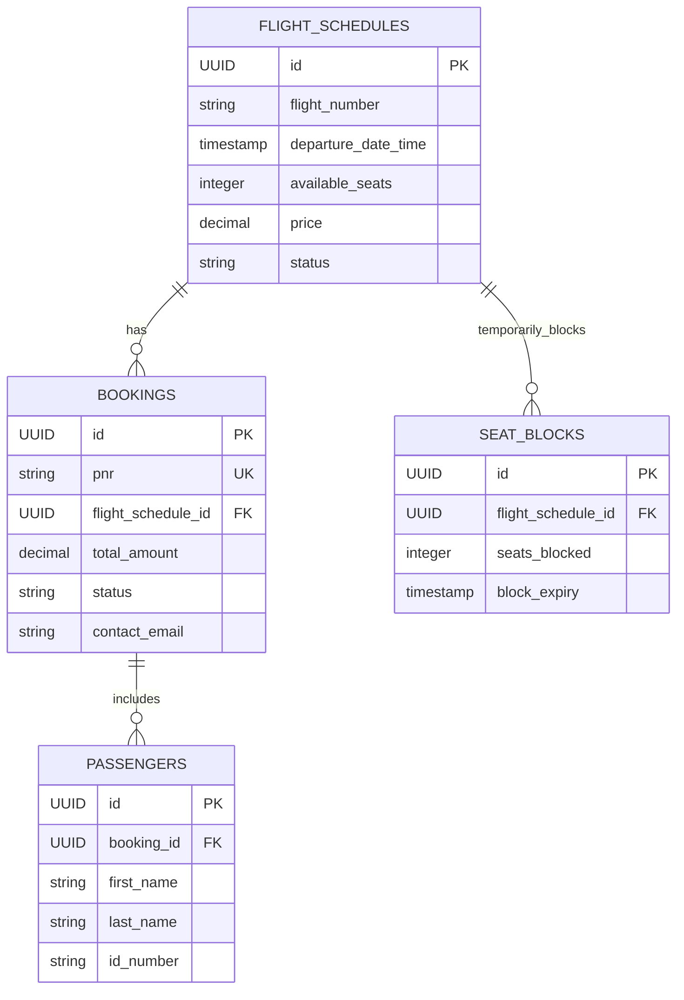
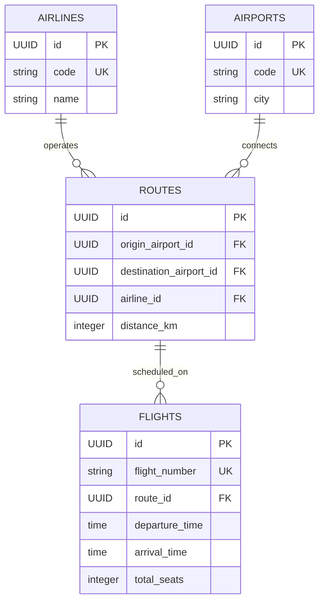

# Entity Relationship Diagrams

> **Note**: The Mermaid diagrams below are simplified for compatibility. Comments have been removed from attribute definitions. For detailed descriptions, see the notes section below each diagram.

## 1. Complete ERD - Mermaid Format

```mermaid
erDiagram
    AIRLINES {
        UUID id PK
        string code UK
        string name
        string country
        boolean is_active
        timestamp created_at
        timestamp updated_at
    }
    
    AIRPORTS {
        UUID id PK
        string code UK
        string name
        string city
        string state
        string country
        string timezone
        timestamp created_at
        timestamp updated_at
    }
    
    ROUTES {
        UUID id PK
        UUID origin_airport_id FK
        UUID destination_airport_id FK
        UUID airline_id FK
        integer distance_km
        decimal base_price
        boolean is_active
        timestamp created_at
        timestamp updated_at
    }
    
    FLIGHTS {
        UUID id PK
        string flight_number UK
        UUID route_id FK
        time departure_time
        time arrival_time
        integer duration_minutes
        string aircraft_type
        integer total_seats
        integer available_seats
        decimal price
        boolean is_active
        timestamp created_at
        timestamp updated_at
    }
    
    FLIGHT_SCHEDULES {
        UUID id PK
        string flight_number FK
        timestamp schedule_date
        timestamp departure_date_time
        timestamp arrival_date_time
        integer available_seats
        decimal price
        string status
        timestamp created_at
        timestamp updated_at
    }
    
    BOOKINGS {
        UUID id PK
        string pnr UK
        UUID flight_schedule_id FK
        timestamp booking_date
        decimal total_amount
        string status
        string payment_status
        string contact_email
        string contact_phone
        timestamp created_at
        timestamp updated_at
    }
    
    PASSENGERS {
        UUID id PK
        UUID booking_id FK
        string first_name
        string last_name
        integer age
        string gender
        string id_type
        string id_number
        string seat_number
        timestamp created_at
    }
    
    PAYMENT_TRANSACTIONS {
        UUID id PK
        UUID booking_id FK
        string transaction_id
        string payment_method
        decimal amount
        string currency
        string status
        jsonb gateway_response
        timestamp created_at
        timestamp updated_at
    }
    
    SEAT_BLOCKS {
        UUID id PK
        UUID flight_schedule_id FK
        string session_id
        integer seats_blocked
        timestamp block_expiry
        string status
        timestamp created_at
    }

    AIRLINES ||--o{ ROUTES : "operates"
    AIRPORTS ||--o{ ROUTES : "origin_of"
    AIRPORTS ||--o{ ROUTES : "destination_of"
    ROUTES ||--o{ FLIGHTS : "has"
    FLIGHTS ||--o{ FLIGHT_SCHEDULES : "scheduled_as"
    FLIGHT_SCHEDULES ||--o{ BOOKINGS : "booked_in"
    BOOKINGS ||--o{ PASSENGERS : "contains"
    BOOKINGS ||--o| PAYMENT_TRANSACTIONS : "paid_via"
    FLIGHT_SCHEDULES ||--o{ SEAT_BLOCKS : "blocks_seats"
```

### Entity Descriptions:
- **AIRLINES**: Airline companies (code: 3 chars like "AI" for Air India)
- **AIRPORTS**: Airport locations (code: 3 chars like "DEL" for Delhi)
- **ROUTES**: Flight paths between airports operated by airlines
- **FLIGHTS**: Specific flight numbers with schedules (e.g., "AI101")
- **FLIGHT_SCHEDULES**: Daily instances of flights with real-time seat availability
- **BOOKINGS**: Customer bookings with unique 6-character PNR
- **PASSENGERS**: Individual passenger details for each booking
- **PAYMENT_TRANSACTIONS**: Payment records for bookings
- **SEAT_BLOCKS**: Temporary seat reservations (stored in Redis with TTL)

## 2. Core Booking Flow ERD

## 3. Flight Management ERD

## Database Design Highlights

### Key Relationships:
1. **One-to-Many**:
   - Airlines → Routes (one airline operates many routes)
   - Routes → Flights (one route has many flights)
   - Flights → FlightSchedules (one flight has many schedules)
   - FlightSchedules → Bookings (one schedule has many bookings)
   - Bookings → Passengers (one booking has many passengers)

2. **Many-to-One**:
   - Routes → Airports (many routes connect two airports)
   - Bookings → FlightSchedules (many bookings for one schedule)

### Indexes Strategy:
- **Primary Keys**: All tables use UUID for distributed systems
- **Unique Constraints**: 
  - Airlines.code, Airports.code
  - Flights.flight_number
  - Bookings.pnr
- **Performance Indexes**:
  - flight_schedules(departure_date_time, available_seats)
  - bookings(flight_schedule_id, status)
  - passengers(booking_id)

### Data Integrity:
- **Foreign Key Constraints**: Maintain referential integrity
- **Check Constraints**: Validate business rules (e.g., age > 0)
- **Unique Constraints**: Prevent duplicates (PNR, flight numbers)

### Partitioning Strategy:
- **flight_schedules**: Range partition by schedule_date (monthly)
- **bookings**: Range partition by booking_date (monthly)
- Benefits: Improved query performance, easier archival

## How to Visualize:

### Option 1: Online Tools
1. Copy the Mermaid code above
2. Visit: https://mermaid.live/
3. Paste the code to see the diagram
4. Export as PNG/SVG for documentation

### Option 2: PlantUML
1. Use the `.puml` file created
2. Visit: http://www.plantuml.com/plantuml/
3. Or use PlantUML plugin in VS Code/IntelliJ

### Option 3: In Documentation
- GitHub/GitLab automatically render Mermaid diagrams
- Many documentation tools support Mermaid natively
- Can be embedded in Confluence, Notion, etc.
